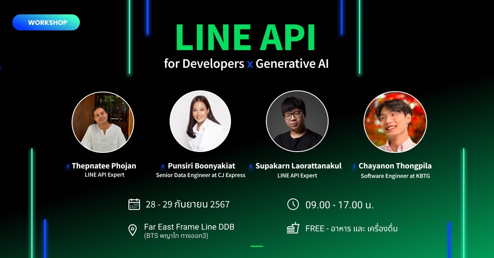

# ยินดีต้อนรับสู่ Workshop LINE Developer x Generative AI

     

## 🎉 แนะนำตัว

ผู้สอน: เทพนที โพธิ์จันทร์ (โอ๋) 
ผู้ช่วยสอน : ศุภกานต์ เหล่รัตนกุล (พร็อมท์) 
ผู้ช่วยสอน : ชญานนท์ ทองพิลา (นัชชี่) 
ผู้ช่วยสอน : Punsiri Boonyakiat (บีทส์)

ยินดีต้อนรับเข้าสู่ **LINE Developer Workshop**!

พวกเรารู้สึกตื่นเต้นที่ได้มีโอกาสพบกับทุกคนในวันนี้ เพื่อร่วมสำรวจเทคโนโลยีและเครื่องมือใหม่ ๆ ที่ LINE มีให้ ไม่ว่าคุณจะมาที่นี่เพื่อพัฒนาทักษะการพัฒนาแอปพลิเคชัน, สำรวจ LINE APIs, หรือสร้างประสบการณ์ใหม่ ๆ สำหรับผู้ใช้งาน เราได้เตรียมกิจกรรมที่มีค่าและการเรียนรู้ที่มีประโยชน์ไว้ให้แล้ว

## 🗓️ สิ่งที่คุณจะได้พบ

ใน Workshop วันนี้เราจะครอบคลุมหัวข้อต่าง ๆ ดังนี้:

### LINE Messaging API
1. Introduction & Overview
2. Understanding LINE Webhook
3. Exploring Webhook Events
4. Mastering Message Objects and Actions
5. Building Chatbots with Cloud Functions for Firebase
6. Advanced Messaging Techniques (Push & Reply Message)
7. Accessing User Profiles for Groups, Rooms, and Users
8. Strengthening Security in LINE Chatbot Development

### Flex Message
1. Exploring Flex Messages
2. Using the Flex Message Simulator
3. Creating Flex Messages with ChatGPT

### Rich Menu
1.  Creating Rich Menus using Messaging API
2.  Using Rich Menu Aliases
3.  Implementing Rich Menu Switch Actions
4.  Linking/Unlinking Rich Menus for Multiple Users

### LINE Frontend-Framework
1. Introduction & Overview
2. Initiating LIFF Applications
3. Authentication
4. Retrieving User Profiles
5. Sending Messages
6. Utilizing LINE URL Schemes
7. Deploying App Hosting

####  Workshop & showcase 
1. Chatbot DISC with ChatGPT-4o
2. Showcase - LINE Pao-Ying-Chub Game
3. Showcase - Storing Files on Cloud Storage for Firebase
4. Showcase - LINE Beacon

### ประโยชน์ที่ทุกคนจะได้ใน Workshop นี้
- ผู้เรียนได้รู้จัก LINE API มากขึ้น 
- เข้าใจถึงการใช้งาน LINE API อย่างมีประสิทธิภาพ 
- สามารถประยุกต์ใช้กับ Product ที่ทำอยู่
- เข้าใจการพัฒนา LINE ด้วยภาษา JavaScript
- Slide การสอน
- กลุ่มไว้ปรึกษา

### 📚 แหล่งข้อมูล

- [เอกสาร LINE API](https://developers.line.biz/en/docs/)

### 🚀 เริ่มต้นกันเถอะ!

เราหวังว่าคุณจะสนุกกับ Workshop และได้รับประสบการณ์ที่มีประโยชน์และแรงบันดาลใจ ขอให้เราทำให้เวลาของเราในวันนี้เป็นสิ่งที่คุ้มค่าและสร้างสรรค์!
