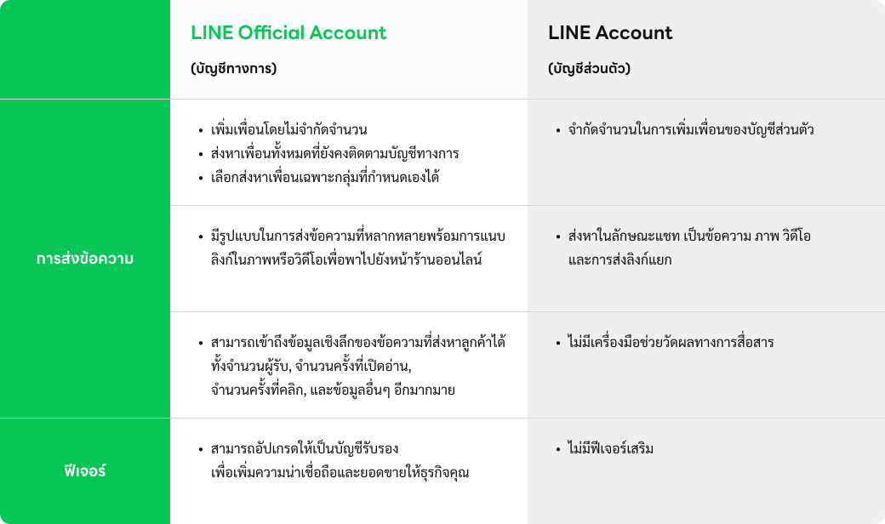
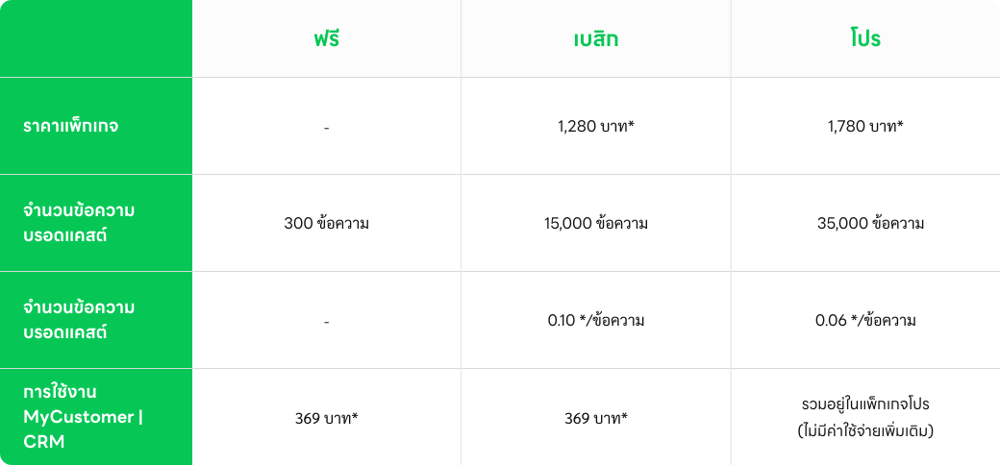
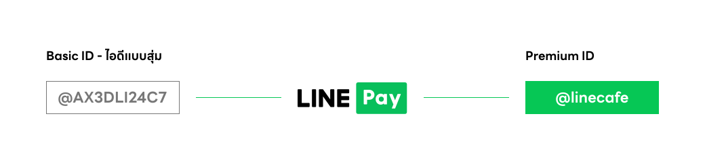

# Introduction & Overview of LINE Official Account

     

**LINE Official Account** เป็นแพลตฟอร์มที่ช่วยให้ธุรกิจหรือบุคคลสามารถสื่อสารและสร้างความสัมพันธ์กับลูกค้าได้อย่างมีประสิทธิภาพผ่านแอปพลิเคชัน LINE ซึ่งมีผู้ใช้จำนวนมากในหลายประเทศ 

#### LINE Official Account กับ บัญชีส่วนตัว

     

#### Feature ของ LINE Official Account

1. ข้อความ Broadcast (Broadcast Message): 
    - สามารถส่งข้อความพร้อมรูปภาพ, วิดีโอ, หรือไฟล์ต่าง ๆ ไปยังผู้ติดตามทั้งหมดได้ในครั้งเดียว
    - มีการตั้งเวลาในการส่งข้อความล่วงหน้าได้
2. ข้อความตอบกลับอัตโนมัติ (Auto Reply) และข้อความทักทาย (Greeting Message):
    -  ตอบกลับอัตโนมัติเมื่อผู้ใช้งานส่งข้อความมาหา
    - สามารถตั้งค่าข้อความทักทายสำหรับผู้ที่เพิ่มบัญชี LINE OA เป็นเพื่อนใหม่ได้
3. Rich Menu:
    - สร้างเมนูที่แสดงผลด้านล่างของหน้าจอแชทเพื่อให้ผู้ใช้งานเข้าถึงฟังก์ชันต่าง ๆ ได้อย่างง่ายดาย เช่น การคลิกเพื่อดูโปรโมชั่น หรือการเข้าสู่เว็บไซต์
4. Rich Message และ Rich Video:
    - ส่งข้อความที่มีการผสานระหว่างรูปภาพหรือวิดีโอกับลิงก์ไปยังผู้ติดตาม เพื่อสร้างความน่าสนใจและเพิ่มโอกาสในการคลิก
5. คูปองและการสะสมแสตมป์ (Coupons & Loyalty Program):
    - สร้างคูปองส่วนลดหรือโปรโมชันพิเศษให้ลูกค้า
    - สามารถสร้างโปรแกรมสะสมแต้มและแสตมป์เพื่อกระตุ้นการกลับมาซื้อซ้ำของลูกค้า
    - `ไม่มี API`
6. การสร้างแบบสอบถาม (Surveys & Polls):
    - สร้างแบบสอบถามหรือโพลเพื่อเก็บข้อมูลหรือความคิดเห็นจากลูกค้า
    - `ไม่มี API`
7. การวิเคราะห์ข้อมูล (Analytics):
    - ดูข้อมูลเชิงสถิติ เช่น จำนวนการส่งข้อความ, จำนวนการเปิดอ่าน, และการคลิก เพื่อวัดผลประสิทธิภาพของแคมเปญ

#### Package ของ LINE Official Account

LINE OA มีแพ็กเกจให้เลือกใช้งานตามความต้องการของธุรกิจ ดังนี้:

     

#### ชนิดของบัญชี LINE Offcial Account

บัญชี LINE เพื่อธุรกิจมีทั้งหมด 3 แบบโดยสามารถดูได้จากสีที่แตกต่างของสีโล่

     

**บัญชีทั่วไป (โล่สีเทา)** ที่ผู้ใช้งาน LINE Official Account จะได้รับเมื่อเริ่มต้นใช้งาน ซึ่งสามารถอัปเกรดบัญชี เป็นบัญชีรับรองหรือบัญชีพรีเมียมได้ในภายหลัง

     

**บัญชีรับรอง (โล่สีน้ำเงิน)** ที่ช่วยให้ลูกค้าค้นหาธุรกิจได้ง่ายขึ้นทั้งบน LINE และ Search engine ต่างๆ โดยมีค่าใช้จ่ายในการดำเนินการ 888 บาท ครั้งเดียว ใช้ได้ตลอดอายุการใช้งาน

     

**บัญชีพรีเมียม (โล่สีเขียว)** ที่เหมาะสำหรับธุรกิจหรือองค์กร ขนาดใหญ่ ที่ต้องการสร้างฐานผู้ติดตามเป็นหลักล้าน สามารถค้นหาเจอได้ง่าย และใช้งานสปอนเซอร์สติกเกอร์ และจะต้องมีใช้จ่ายขั้นต่ำตามที่กำหนด

#### Premium ID คืออะไร

LINE Official Account จะได้รับ ID แบบอักษรสุ่มผสมตัวเลขหรือ Basic ID ผู้ใช้งานจะสามารถซื้อ Premium ID เพื่อเปลี่ยนชื่อ Basic ID ให้เป็นชื่อแบรนด์ หรือธุรกิจ โดยจะมีค่าใช้จ่ายเพียง 444 บาทต่อปี เมื่อสมัครผ่านแอนดรอยด์ หรือเว็บไซต์ และมีค่าใช้จ่าย 459 บาทเมื่อสมัครผ่าน iOS

     

**สำหรับผู้ใช้ระบบ iOS**

1) สามารถสมัครได้สูงสุด 1 Premium ID ต่อ 1 ID

2) ไม่สามารถเปลี่ยนแปลง Premium ID นั้น ๆ ได้ภายใน 1 ปี ทั้งนี้ หากผู้ใช้มีมากกว่า 1 บัญชี แนะนําให้สมัครผ่านเว็บไซต์ manager.line.biz

3) เมื่อครบ 1 ปีตามกําหนด ระบบจะต่ออายุบัญชีโดยอัตโนมัติ หากผู้ใช้ต้องการเปลี่ยนชื่อ Premium ID จําเป็นต้องยกเลิกก่อนวันหมดอายุ อย่างน้อย 1 วัน