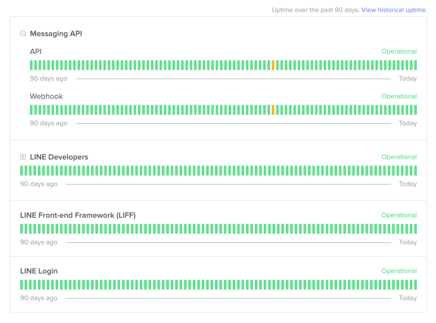

# LINE API Status

     

[LINE API Status](https://api.line-status.info/) เป็นเว็บไซต์ที่คุณสามารถตรวจสอบสถานะการให้บริการและปัญหาที่เกิดขึ้นกับ API และบริการต่าง ๆ ที่บริษัท LY ให้บริการได้

LINE API Status ครอบคลุมบริการดังต่อไปนี้:

-   Messaging API (API / Webhook)
-   LINE Developers (Website / Console)
-   LINE Front-end Framework (LIFF)
-   LINE Login

ปัจจุบัน LINE API Status ยังไม่ครอบคลุมถึงแอป LINE และบริการอื่น ๆ นอกเหนือจากที่กล่าวมา (เช่น LINE MINI App และ LINE Pay)

บริษัท LY จะแจ้งข้อมูลเกี่ยวกับปัญหาที่เกิดขึ้นผ่าน LINE API Status แต่ไม่ได้รับประกันว่าข้อมูลจะถูกต้อง ทันที หรือครอบคลุมทั้งหมด เราจะยังคงแจ้งรายละเอียดเกี่ยวกับปัญหา เช่น สาเหตุและขอบเขตของผลกระทบ ผ่านข่าวสารในเว็บไซต์ LINE Developers (https://developers.line.biz/)

สามารถตรวจสอบสถานะการให้บริการของ LINE API ได้ที่ [api.line-status.info](https://api.line-status.info/)