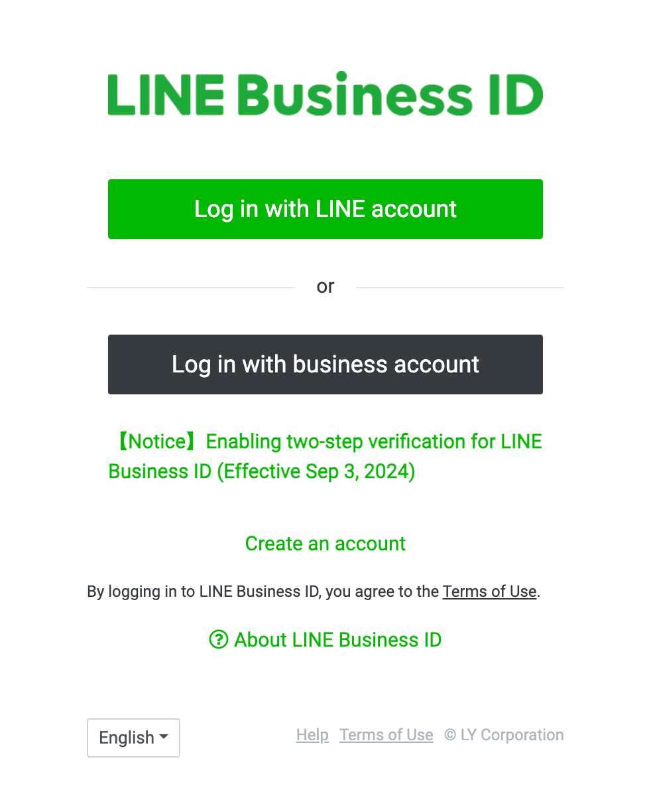
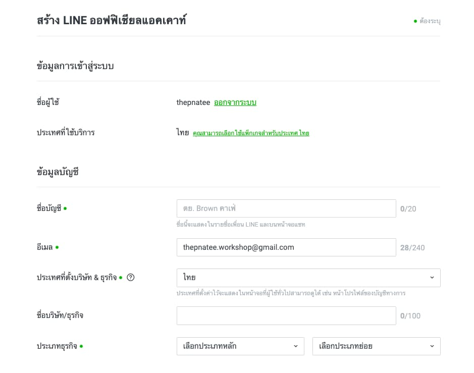

# Open LINE Official Account

1. ไปที่ [LINE Official Account Manager (manager.line.biz)](https://manager.line.biz)

2. เข้าสู่ระบบด้วย LINE ของคุณ โดยคลิกปุ่ม "Log in with LINE account" (หากอยู่ในระบบแล้ว ข้ามไปขั้นตอนถัดไป)

<p align="center">
    
</p>

3. สร้าง LINE Official Account (LINE OA)

   - คลิกปุ่ม "Create new" ที่แถบเมนูด้านซ้ายมือ
   - ยืนยันบัญชี LINE Business ID ผ่าน SMS (หากมี)
   - กรอกข้อมูล LINE Official Account ที่ต้องการสร้าง ดังนี้:
     - **ชื่อบัญชี**: เช่น "Brown คาเฟ่" ซึ่งจะแสดงในรายชื่อเพื่อน LINE และบนหน้าจอแชท (สูงสุด 20 ตัวอักษร)
     - **อีเมล**: เช่น "workshop@gmail.com"
     - **ประเทศที่ตั้งบริษัท**: เช่น "ไทย"
     - **ชื่อบริษัท/ธุรกิจ**: (สูงสุด 100 ตัวอักษร)
     - **ประเภทธุรกิจ**: เลือกประเภทหลักและประเภทเสริมที่เหมาะสม
     - **หมายเหตุ**: กรณีที่ต้องการสร้าง LINE OA เพื่อให้บริการในประเทศไทย ตรวจสอบ "ประเทศที่ใช้บริการ" จะต้องเป็น "ไทย" เท่านั้น ไม่เช่นนั้น LINE Thailand จะไม่สามารถให้การสนับสนุนได้ และจะไม่สามารถสมัครแพ็กเกจที่ให้บริการในประเทศไทยได้

<p align="center">
     
</p>

4. เชื่อมต่อ LINE Official Account กับ LINE Messaging API

   - คลิกที่ LINE Official Account ที่สร้างขึ้นไว้
   - คลิกที่ "Settings" ในแถบเมนูด้านบน
   - คลิกที่ "Messaging API" ภายใต้ "Settings" ในแถบเมนูด้านซ้ายมือ
   - คลิกปุ่ม "Enable Messaging API"
   - กรอกชื่อ Provider ที่ต้องการสร้าง (โพรไวเดอร์คือบุคคลที่เป็นนักพัฒนา บริษัท องค์กร หรืออื่นๆ ที่เป็นผู้ให้บริการดูแลข้อมูลส่วนบุคคลของลูกค้า) *ห้ามมีคำว่า LINE หรือเลือกจาก Provider ที่มีอยู่แล้ว
   - คลิกปุ่ม "Agree" เพื่อยืนยันการเชื่อมต่อ
   - **หมายเหตุ**: หลังจากการเชื่อม Provider แล้ว คุณจะไม่สามารถย้าย Channel ไปยัง Provider อื่นได้ในภายหลัง

<p align="center" width="100%">
     
</p>


1. สร้าง Channel
- คลิก [LINE Developers](https://developers.line.biz/en/)
<p align="center" width="100%">
     
</p>
- เลือก Channel ที่ได้ทำการสร้างไว้
<p align="center" width="100%">
     
</p>
- สิ่งที่สามารถแก้ไขมีได้ดังต่อไปนี้

| Items                   | Screen where information is displayed                        |
| ----------------------- | ------------------------------------------------------------ |
| Channel icon (optional) | LINE chat screen, icon (only if you have a LIFF app)         |
| Channel name            | LINE chat screen                                             |
| Channel description     | LIFF permission consent screen (only if you have a LIFF app) |
| Privacy (optional)      | LIFF permission consent screen (only if you have a LIFF app) |
| Terms of use (optional) | LIFF permission consent screen (only if you have a LIFF app) |

```markdown
##### ข้อควรระวังในการเชื่อมโยง Channel และ Provider

เมื่อคุณสร้าง Channel แล้ว คุณไม่สามารถย้ายช่องทางนั้นไปยัง Provider อื่นได้ในภายหลัง

เมื่อพัฒนาบริการที่เชื่อมโยงMessaging API channel และ LINE Login channel ควรสร้างทั้งสองช่องทางภายใต้ผู้ `Provider` เดียวกัน

ผู้ใช้ LINE ที่ใช้บริการจากนักพัฒนาจะได้รับ User ID ผู้ใช้ที่แตกต่างกันสำหรับแต่ละ`Provider` โดย User ID ผู้ใช้ไม่สามารถใช้ในการระบุผู้ใช้คนเดียวกันข้ามช่องทางที่อยู่ภายใต้ `Provider` ที่แตกต่างกัน
````
<p align="center" width="100%">
     
</p>


````
ตัวอย่างเช่น กรณีดังต่อไปนี้ต้องให้ความสนใจเป็นพิเศษ:

- Channel และ Provider ถูกจัดการโดยบุคคลหรือบริษัท
- สร้าง Channel ของบริการหรือบริษัทที่ไม่เกี่ยวข้องภายใต้ Provider เดียวกัน
- Channel ถูกสร้างภายใต้ Provider ที่จัดการโดยบริษัท
````
กรณีเช่นนี้ อาจเกิดปัญหาในอนาคตจากการที่ไม่สามารถย้าย Channel ระหว่าง Providers ได้ในภายหลัง และข้อเท็จจริงที่ว่า User จะได้รับ ID ที่แตกต่างกันสำหรับ Providers ต่าง ๆ หลังจากพิจารณาความเสี่ยงที่เกี่ยวข้องแล้ว ควรสร้าง Channel ภายใต้ Provider ที่เหมาะสม

----
 https://contact-cc.line.me
 