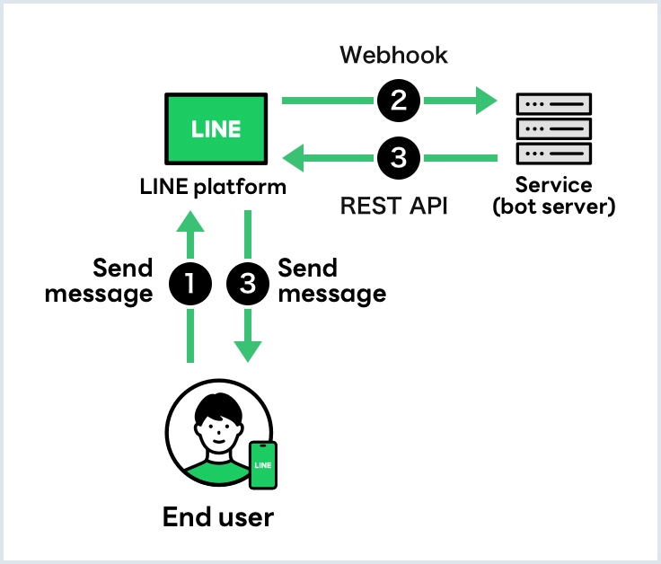

# LINE Messaging API คืออะไร?

**LINE Messaging API** คือ API ที่ทำหน้าที่เป็นตัวกลางที่จะเชื่อมต่อ Server ของเราเข้ากับ LINE Official Account ทำให้เราสามารถเขียนโปรแกรมเพื่อสร้างบริการที่เราต้องการ ผ่านการข้อความและโต้ตอบกับผู้ใช้ในลักษณะ Chatbot ได้นั่นเอง 

## การทำงานของ LINE Messaging API

     

**LINE Messaging API** จะถูกแยกเป็น 2 ส่วน คือ

### Webhook

1. ผู้ใช้ส่งข้อความไปยัง LINE Official Account

2. เซิร์ฟเวอร์ LINE ส่ง Webhook Event ไปยังเซิร์ฟเวอร์ของเราที่ตั้งค่าไว้เป็น Webhook URL ใน [LINE Developers Console](https://developers.line.biz/console/)

### API

การใช้ API ใน LINE Messaging API สามารถใช้ได้ในสองรูปแบบ คือ

1. **2-way** เซิร์ฟเวอร์ของเราเรียกใช้ LINE Messaging API (3) เพื่อส่งข้อความตอบกลับผู้ใช้ หลังจากที่ได้รับ Webhook Event จาก LINE (2) โดยใช้ Reply Token ที่ได้รับจาก Webhook Event การตอบกลับจะไม่มีการหักโควต้าข้อความจากแพ็กเกจ สามารถส่งข้อความได้ฟรี 1 ข้อความ สูงสุด 5 Bubbles ด้วย Reply Token 

2. **1-way** เซิร์ฟเวอร์ของเราส่งข้อความไปยัง LINE Messaging API เพื่อส่งข้อความไปยังผู้ใช้ (3) ซึ่งจะมีการหักโควต้าข้อความจากแพ็กเกจ**ตามจำนวนผู้ใช้ที่ได้รับข้อความ**

## ตัวอย่างการใช้งาน LINE Messaging API

- **ส่งข้อความตอบกลับ**: ส่งข้อความตอบกลับผู้ใช้ที่เพิ่ม LINE Official Account เป็นเพื่อน หรือสนทนากับ LINE Official Account

- **ส่งข้อความ**: ส่งข้อความถึงผู้ใช้ได้ทุกเมื่อ ด้วยหลายรูปแบบของข้อความ เช่น ข้อความ, สติกเกอร์, รูปภาพ, วิดีโอ, และอื่น ๆ

- **รับข้อมูลจากผู้ใช้**: รับรูปภาพ, วิดีโอ, เสียง, และไฟล์ที่ผู้ใช้ส่งมาในแชทกับ LINE Official Account

- **ดึงโปรไฟล์ผู้ใช้**: ดึงข้อมูลโปรไฟล์ของผู้ใช้ LINE ที่เป็นเพื่อนกับ LINE Official Account

- **เข้าร่วมแชทกลุ่ม**: ส่งข้อความและรับข้อมูลสมาชิกในแชทกลุ่ม

- **ใช้งานเมนูที่กำหนดเอง**: ตั้งค่าและปรับแต่งเมนูในแชท

- **ใช้งานบีคอน**: โต้ตอบกับผู้ใช้ที่เข้าสู่บริเวณสัญญาณจากอุปกรณ์บีคอน

- **เชื่อมโยงบัญชีผู้ใช้**: เชื่อมโยงบัญชีผู้ใช้กับบัญชี LINE อย่างปลอดภัย

----
 https://contact-cc.line.me
 