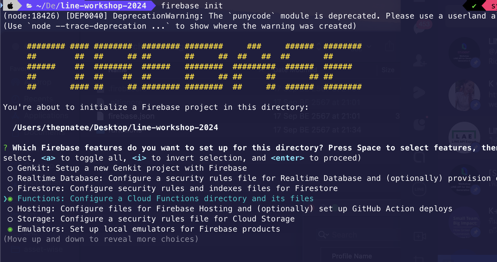
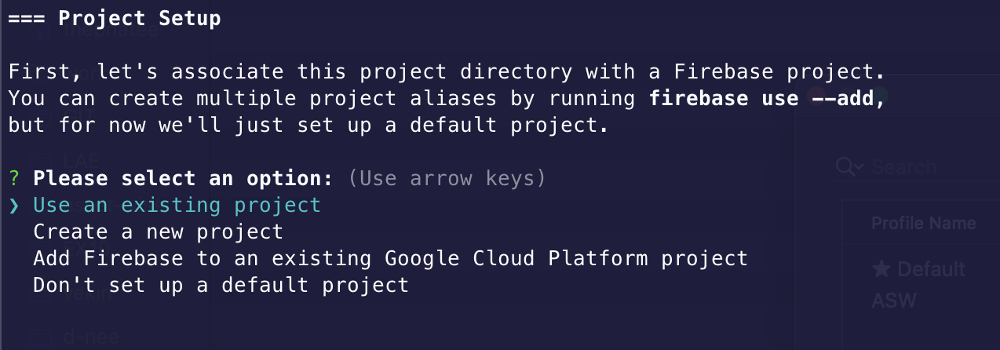
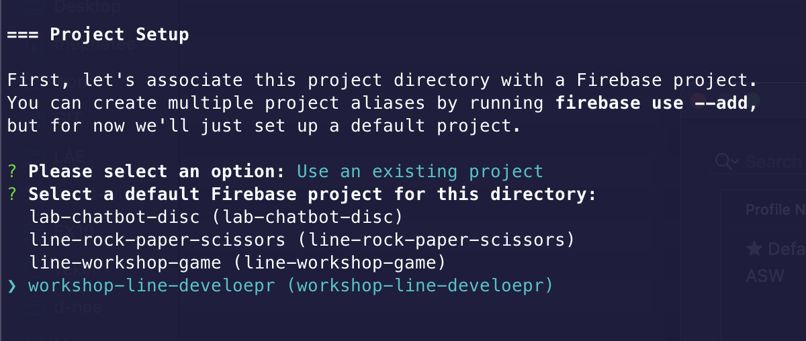
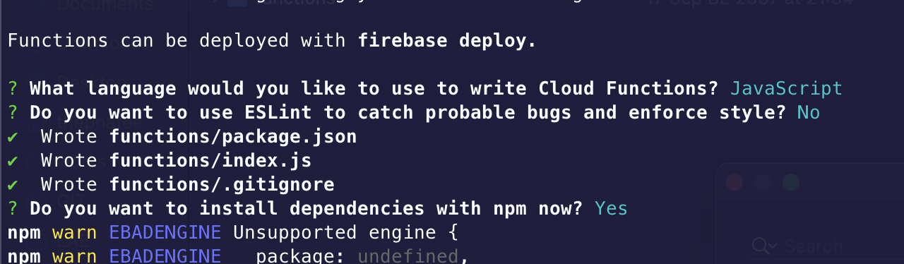
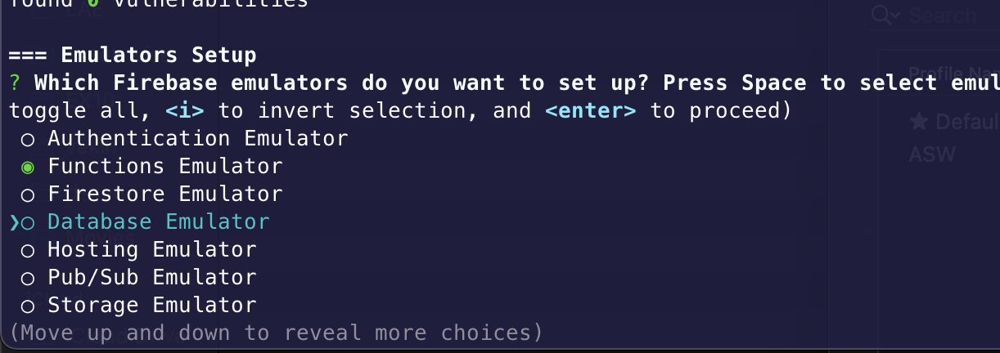
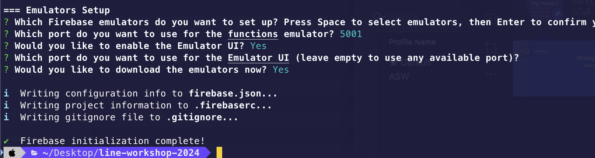

# การสร้าง LINE Chatbot ด้วย Firebase

## 🔥 Firebase คืออะไร?

Ref : https://medium.com/firebasethailand/cdda33bbd7dd

**Firebase** เป็นแพลตฟอร์มที่พัฒนาโดย Google ซึ่งให้บริการเครื่องมือและโครงสร้างพื้นฐานที่ช่วยให้นักพัฒนาสามารถสร้างและจัดการแอปพลิเคชันได้อย่างรวดเร็วและง่ายดาย Firebase มีบริการหลายประเภทที่ช่วยในด้านต่าง ๆ ของการพัฒนาแอปพลิเคชัน เช่น:

- **Firebase Cloud Functions**: ฟังก์ชันที่รันบนคลาวด์ซึ่งช่วยให้คุณสามารถเขียนและดำเนินการโค้ดที่ตอบสนองต่อเหตุการณ์ต่าง ๆ ได้
- **Firebase Firestore**: ฐานข้อมูล NoSQL ที่มีการจัดการแบบเอกสาร ซึ่งช่วยในการจัดเก็บและจัดการข้อมูล
- **Firebase Hosting**: บริการโฮสติ้งที่ช่วยให้คุณสามารถเผยแพร่เว็บไซต์และแอปพลิเคชันเว็บได้อย่างรวดเร็ว
- **Firebase Realtime Database**: ฐานข้อมูล NoSQL ที่ช่วยให้คุณสามารถจัดเก็บและซิงโครไนซ์ข้อมูลในเวลาเรียลไทม์
- **Firebase Authentication**: ระบบการจัดการการลงชื่อเข้าใช้ที่ช่วยให้ผู้ใช้สามารถเข้าสู่ระบบด้วยวิธีที่หลากหลาย


## 🛠️ ขั้นตอนที่ 1: เตรียมตวามพร้อม

1. **สร้างบัญชี LINE Developer**
   - เข้าสู่ [LINE Developer Console](https://developers.line.biz/console/) และลงชื่อเข้าใช้ด้วยบัญชี LINE ของคุณ
   - สร้าง Provider ใหม่และสร้าง Channel ใหม่สำหรับ LINE Messaging API

2. **ตั้งค่า Firebase Project**
   - ไปที่ [Firebase Console](https://console.firebase.google.com/)
   - คลิก "Add project" และทำตามขั้นตอนเพื่อสร้าง Firebase Project ใหม่
   - ตั้งค่า Firebase Cloud Functions และ Firebase Firestore ตามความต้องการของคุณ

## 📦 ขั้นตอนที่ 2: การตั้งค่า LINE Messaging API

1. **ลงทะเบียน LINE Bot**
   - ไปที่ [LINE Developers Console](https://developers.line.biz/console/)
   - เลือก Channel ที่สร้างขึ้นและบันทึก Channel ID, Channel Secret และ Access Token

2. **ตั้งค่า Webhook**
   - ใน LINE Developers Console, ไปที่การตั้งค่า Webhook ของ Channel และเปิดใช้งาน Webhook URL
   - Webhook URL นี้จะเป็นที่อยู่ที่ Firebase Cloud Functions ของคุณจะตอบกลับ

## 🧩 ขั้นตอนที่ 3: การสร้าง Firebase Cloud Function

1. **ติดตั้ง Firebase CLI**
   - เปิด Terminal หรือ Command Prompt และติดตั้ง Firebase CLI ด้วยคำสั่ง:
     ```bash
     npm install -g firebase-tools
     ```

2. **เข้าสู่ระบบ Firebase**
   - เข้าสู่ระบบ Firebase ด้วยคำสั่ง:
     ```bash
     firebase login
     ```

3. **สร้างโปรเจกต์ Firebase**
   - สร้างโปรเจกต์ Firebase ใหม่ในไดเรกทอรีที่คุณต้องการ:
     ```bash
     firebase init
     ```
<p align="center" width="100%">
     
</p>   
<p align="center" width="100%">
     
</p>   
<p align="center" width="100%">
     
</p>   
<p align="center" width="100%">
     
</p>   
<p align="center" width="100%">
     
</p>   
<p align="center" width="100%">
     
</p>  

4. **ติดตั้ง dependencies**
   - ไปที่ไดเรกทอรี `functions` และติดตั้ง dependencies ที่จำเป็นสำหรับการทำงานของ Cloud Functions:
     ```bash
     cd functions
     npm install
     ```

5. **เขียน Cloud Function**
   - แก้ไขไฟล์ `index.js` ในไดเรกทอรี `functions` และเพิ่มโค้ดดังนี้:
     ```javascript
      const { setGlobalOptions } = require("firebase-functions/v2");
      const { onRequest } = require("firebase-functions/v2/https");
      setGlobalOptions({
         region: "asia-northeast1",
         memory: "1GB",
         concurrency: 40,
      })

      exports.webhook = onRequest(async (request, response) => {
         const events = request.body.events
         for (const event of events) {
            console.log("evnet: ", JSON.stringify(event))
         }
         return response.end();

      });
     ```

## ⚙️ ขั้นตอนที่ 4: การใช้ Firebase Emulator

**เริ่มต้น Firebase Emulator**
   - ใช้คำสั่งนี้เพื่อเริ่มต้น Firebase Emulator Suite และทดสอบ Cloud Functions ของคุณในสภาพแวดล้อมที่ท้องถิ่น:
     ```bash
     firebase emulators:start
     ```

   - คุณจะเห็น URL ที่ Local Emulator สำหรับ Cloud Functions ซึ่งคุณสามารถใช้ในการทดสอบ

---

หากคุณต้องการข้อมูลเพิ่มเติมเกี่ยวกับการใช้งาน LINE Messaging API และ Firebase Cloud Functions, โปรดดูเอกสารที่ [LINE Developers](https://developers.line.biz/en/docs/) และ [Firebase Documentation](https://firebase.google.com/docs)
