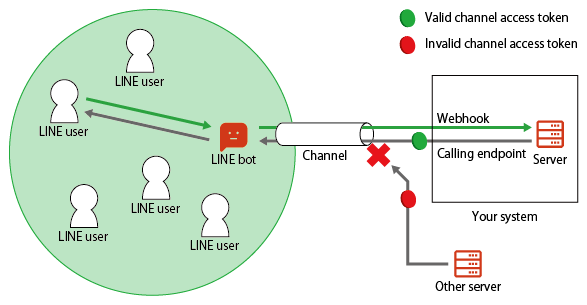

# Channel Access Token
Channel Access Token คือคีย์ที่ใช้ในการยืนยันการเข้าถึงฟีเจอร์ต่างๆ ของ LINE Platform โดยสำคัญสำหรับการใช้งาน API เช่น Messaging API

<p align="center" width="100%">
     
</p>

ประเภทของ Channel Access Tokens
1. User-Specified Expiration (v2.1): มีอายุสูงสุด 30 วัน ออกได้สูงสุด 30 โทเค็นต่อช่องทาง
2. Stateless: มีอายุ 15 นาที ออกได้ไม่จำกัด
3. Short-Lived: มีอายุ 30 วัน ออกได้สูงสุด 30 โทเค็นต่อช่องทาง
4. Long-Lived: ไม่มีวันหมดอายุ ออกได้หนึ่งโทเค็นต่อช่องทาง


### Long-lived Channel Access Token
Channel Access Token ประเภทนี้คือ Long-lived ไม่มีวันหมดอายุ (อายุยืนยาว)
- ข้อดี: Issue ง่าย maintain ง่าย
- ข้อเสีย: ความปลอดภัยน้อย เพราะกรณีที่หลุดไป Hacker สามารถนำไปใช้กับ API ต่างๆเช่น Broadcast ข้อความได้แบบยาวๆไปเลย

1. การ Issue
การ Issue ตัว Channel Access Token ประเภทนี้ ก็แสนง่ายเพียงกดปุ่ม Issue ที่อยู่ใน Messaging API Channel เท่านั้น

<p align="center" width="100%">
     
</p>


2. การ Revoke
ในกรณีที่นักพัฒนาไม่แน่ใจหรือแน่ใจก็ตาม ว่าตัว Token ได้ Leak ออกไป นักพัฒนาก็สามารถ Revoke ตัว Token ประเภทนี้ได้ 2 วิธีด้วยกัน

- วิธีที่ 1 กด Reissue ในหน้า Messaging API Channel
วิธีนี้จะทำการออกตัว Token ตัวใหม่พร้อมกับการยกเลิกตัวเก่า โดยนักพัฒนาสามารถกำหนดช่วงเวลาที่จะให้ Token ตัวเก่ามีชีวิตอยู่ต่อไปได้ตั้งแต่ 0–24 ช.ม ซึ่ง 0 ก็หมายถึงให้ Revoke ทันที (จากการทดลองคือจะหมดอายุภายใน 5 นาที)

<p align="center" width="100%">
     
</p>
 
- วิธีที่ 2 Revoke ผ่าน API
วิธีนี้เป็นวิธี Revoke ตัว Token แบบทันทีทันใด โดยนักพัฒนาจะต้องสร้าง Request เพื่อไป Revoke ผ่าน API ตามรายละเอียดด้านล่างนี้

```curl 
Endpoint https://api.line.me/v2/oauth/revoke
Method POST
Headers
  Content-type: application/x-www-form-urlencoded
Body
  access_token: Channel Access Token

```
 3. การ Verify
กรณีที่นักพัฒนาต้องการตรวจสอบหรือยืนยันสถานะของตัว Channel Access Token ว่ามัน valid หรือ invalid ก็สามารถทำได้ผ่าน API โดยให้สร้าง Request เพื่อไป Verify ตามรายละเอียดด้านล่างนี้
```curl
Endpoint https://api.line.me/v2/oauth/verify
Method POST
Headers
  Content-type: application/x-www-form-urlencoded
Body
  access_token: Channel Access Token
```
โดยกรณีที่ Request สำเร็จ เราจะได้ HTTP Status Code 200 กลับมาพร้อมกับ JSON object ที่บอกระยะเวลาที่เหลือของ Token ตัวนั้นๆ เช่น
```json
{
  "client_id": "1350031035",
  "expires_in": 3138007490,
  "scope": "P CM"
}
```

### Short-lived Channel Access Token
ด้วยชื่อของ Channel Access Token ประเภทนี้คือ Short-lived คุณสมบัติพิเศษของตัวมันคือ อายุที่สั้นลง(เพียง 30 วัน) โดยที่ 1 Channel จะสามารถ Issue ตัว Token ได้เรื่อยๆสูงสุด 30 Tokens โดยหาก Issue เกินกว่า 30 ระบบจะ Revoke ตัว Token ที่เก่าที่สุดออกตามลำดับ

- ข้อดี: ปลอดภัยปานกลาง ด้วยอายุ 30 วันของ Token แต่ละตัว
- ข้อเสีย: กรณีที่หลุดไป Hacker สามารถนำไปใช้กับ API ต่างๆเช่น Broadcast ข้อความได้สูงสุด 30 วัน และการจัดการ Token ประเภทนี้ค่อนข้างยุ่งยาก เนื่องจากต้องมีเงื่อนไขในการตรวจสอบสถานะ และการจัดเก็บตัว Token

1. การ Issue
การ Issue ตัว Channel Access Token ประเภทนี้ จะต้องทำผ่าน API โดยนักพัฒนาจะต้องสร้าง Request ตามรายละเอียดด้านล่างนี้
```curl
Endpoint https://api.line.me/v2/oauth/accessToken
Method POST
Headers
  Content-type: application/x-www-form-urlencoded
Body
  grant_type: client_credentials
  client_id: Channel ID
  client_secret: Channel Secret
```
โดยกรณีที่ Request สำเร็จ เราจะได้ HTTP Status Code 200 กลับมาพร้อมกับ JSON object ที่มีตัว Channel Access Token และระยะเวลาที่เหลือของ Token ตัวนั้น เช่น
```json
{
  "access_token": "W1TeHCgfH2Liwa.....",
  "expires_in": 2592000,
  "token_type": "Bearer"
}
```
2. การ Revoke
ในกรณีที่นักพัฒนาไม่แน่ใจหรือแน่ใจก็ตาม ว่าตัว Token ได้ Leak ออกไป นักพัฒนาก็สามารถ Revoke ตัว Token ประเภทนี้ผ่านการ Request API ตามรายละเอียดดังนี้
```curl
Endpoint https://api.line.me/v2/oauth/revoke
Method POST
Headers
  Content-type: application/x-www-form-urlencoded
Body
  access_token: Channel Access Token
```
3. การ Verify
กรณีที่นักพัฒนาต้องการตรวจสอบหรือยืนยันสถานะของตัว Channel Access Token ว่ามัน valid หรือ invalid ก็สามารถทำได้ผ่าน API โดยให้สร้าง Request เพื่อไป Verify ตามรายละเอียดด้านล่างนี้
```curl
Endpoint https://api.line.me/v2/oauth/verify
Method POST
Headers
  Content-type: application/x-www-form-urlencoded
Body
  access_token: Channel Access Token
```
โดยกรณีที่ Request สำเร็จ เราจะได้ HTTP Status Code 200 กลับมาพร้อมกับ JSON object ที่บอกระยะเวลาที่เหลือของ Token ตัวนั้นๆ เช่น
```json
{
  "client_id": "1350031035",
  "expires_in": 3138007490,
  "scope": "P CM"
}
```

### Channel Access Token v2.1

<p align="center" width="100%">
     
</p>
Channel Access Token ที่ให้นักพัฒนาสามารถ กำหนดอายุของตัว Token ได้เองสูงสุด 30 วัน โดยที่ 1 Channel จะสามารถ Issue ตัว Token ได้เรื่อยๆสูงสุด 30 Tokens

- ข้อดี: ปลอดภัยสูงสุด ด้วยอายุที่กำหนดให้สั้นตามต้องการได้ และใช้ JWT ที่เวลาจำกัด 30 นาที แทนที่ Channel Secret ในการ Issue ตัว Token แต่ละครั้ง
- ข้อเสีย: ขั้นตอนในการ Issue และการบริหารจัดการค่อนข้างซับซ้อน


1. การ Issue
การ Issue ตัว Channel Access Token ประเภทนี้ จะต้องทำผ่าน API โดยนักพัฒนาจะต้องสร้าง Request ตามรายละเอียดด้านล่างนี้
```curl
Endpoint https://api.line.me/oauth2/v2.1/token
Method POST
Headers
  Content-type: application/x-www-form-urlencoded
Body
  grant_type: client_credentials
  client_assertion_type: urn:ietf:params:oauth:client-assertion-type:jwt-bearer
  client_assertion: JWT ที่ sign ด้วย Assertion Signing Key
```
โดยกรณีที่ Request สำเร็จ เราจะได้ HTTP Status Code 200 กลับมาพร้อมกับ JSON object ที่มีตัว Channel Access Token และระยะเวลาที่เหลือของ Token ตัวนั้น เช่น
```json
{
  "access_token": "eyJhbGciOiJIUz.....",
  "token_type": "Bearer",
  "expires_in": 2592000,
  "key_id": "sDTOzw5wIfxxxxPEzcmeQA"
}
```
2. การ Revoke
ในกรณีที่นักพัฒนาไม่แน่ใจหรือแน่ใจก็ตาม ว่าตัว Token ได้ Leak ออกไป นักพัฒนาก็สามารถ Revoke ตัว Token ประเภทนี้ผ่านการ Request API ตามรายละเอียดดังนี้
```curl
Endpoint https://api.line.me/oauth2/v2.1/revoke
Method POST
Headers
  Content-type: application/x-www-form-urlencoded
Body
  access_token: Channel Access Token
  client_id: Channel ID
  client_secret: Channel Secret
```
3. การ Verify
กรณีที่นักพัฒนาต้องการตรวจสอบหรือยืนยันสถานะของตัว Channel Access Token ว่ามัน valid หรือ invalid ก็สามารถทำได้ผ่าน API โดยให้สร้าง Request เพื่อไป Verify ตามรายละเอียดด้านล่างนี้
```curl
Endpoint https://api.line.me/oauth2/v2.1/verify
Method GET
Query param
  access_token: Channel Access Token
```
โดยกรณีที่ Request สำเร็จ เราจะได้ HTTP Status Code 200 กลับมาพร้อมกับ JSON object ที่บอกระยะเวลาที่เหลือของ Token ตัวนั้นๆ เช่น
```json
{
  "client_id": "1573163733",
  "expires_in": 2591659,
  "scope": "profile chat_message.write"
}
```

4. การดึง Channel Access Token ที่ยัง Valid ทั้งหมด
สำหรับ Channel Access Token v2.1 จะมี API พิเศษเสริมมาอีกเส้น คือเราสามารถดึง Token ที่ยัง Valid ทั้งหมดออกมาดูได้ด้วย โดยให้สร้าง Request ตามรายละเอียดด้านล่างนี้
```curl
Endpoint https://api.line.me/oauth2/v2.1/tokens/kid
Method POST
Headers
  Content-type: application/x-www-form-urlencoded
Query Params
  client_assertion_type: urn:ietf:params:oauth:client-assertion-type:jwt-bearer
  client_assertion: JWT ที่ sign ด้วย Assertion Signing Key
```
โดยกรณีที่ Request สำเร็จ เราจะได้ HTTP Status Code 200 กลับมาพร้อมกับ JSON object ที่บรรจุ Token ที่ยัง Valid ไว้ เช่น

```json
{
  "kids": [
    "U_gdnFYKTWRxxxxDVZexGg",
    "sDTOzw5wIfWxxxxzcmeQA",
    "G82YP96jhHwyKSxxxx7IFA"
  ]
}
```


### Stateless Channel Access Token
Channel Access Token ประเภทล่าสุดที่มี อายุที่สั้น(เพียง 15 นาที) โดยที่ 1 Channel จะสามารถ Issue ตัว Token ได้เรื่อยๆไม่จำกัด

ข้อดี: ปลอดภัยสูง ด้วยอายุเพียง 15 นาทีของ Token แต่ละตัว ทำให้ลดปัญหา Replay Attack ในกรณีที่ Token หลุดไปได้เยอะ แถมไม่ต้องมีกระบวนการจัดเก็บ เพราะเราสามารถ Issue ได้ไม่จำกัด
ข้อเสีย: จะต้องมีการ Issue บ่อยครั้ง ทำให้อาจมี Latency ได้
1. การ Issue
การ Issue ตัว Channel Access Token ประเภทนี้ จะต้องทำผ่าน API โดยนักพัฒนาจะต้องสร้าง Request ตามรายละเอียดด้านล่างนี้
```curl
Endpoint https://api.line.me/oauth2/v3/token
Method POST
Headers
  Content-type: application/x-www-form-urlencoded

// ตัว Request body ที่จะส่งไปสามารถเลือกได้ 2 วิธี

// 1. จาก Channel ID และ Channel Secret (แบบพื้นฐาน)
Body
  grant_type: client_credentials
  client_id: Channel ID
  client_secret: Channel Secret

// 2. จาก JWT Assertion (แบบขั้นสูง)
Body
  grant_type: client_credentials
  client_assertion_type: URL-encoded ของ urn:ietf:params:oauth:client-assertion-type:jwt-bearer
  client_assertion: JWT ที่ generate จากฝั่ง client และ sign ด้วย private key
```

โดยกรณีที่ Request สำเร็จ ไม่ว่าจะใช้การส่ง Request body ด้วยวิธีการใด เราจะได้ HTTP Status Code 200 กลับมาพร้อมกับ JSON object ที่มีตัว Channel Access Token และระยะเวลาที่เหลือของ Token ตัวนั้น เช่น
```json
{
  "access_token": "W1TeHCgfH2Liwa.....",
  "expires_in": 900,
  "token_type": "Bearer"
}
```
2. การ Revoke และ Verify
เนื่องจาก Stateless Channel Access Token เป็น Token ที่มีอายุสั้นเพียง 15 นาที สามารถ Issue ได้แบบไม่จำกัด และไม่จำเป็นต้องมีการจัดเก็บ ดังนั้นจึงมีความปลอดภัยค่อนข้างสูง สามารถใช้งานครั้งต่อครั้งได้เลย ทำให้ไม่ต้องมีการ Revoke เกิดขึ้น

