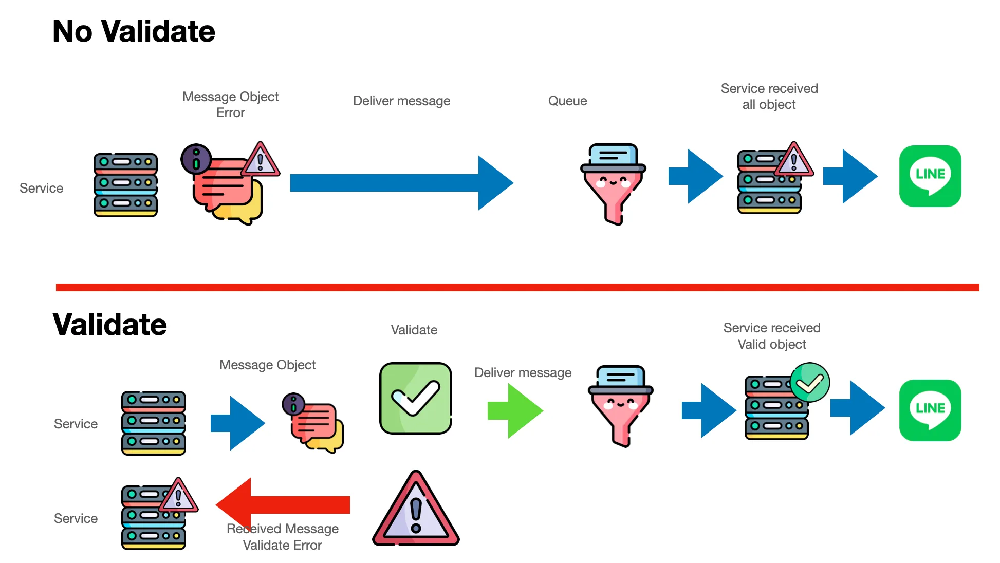
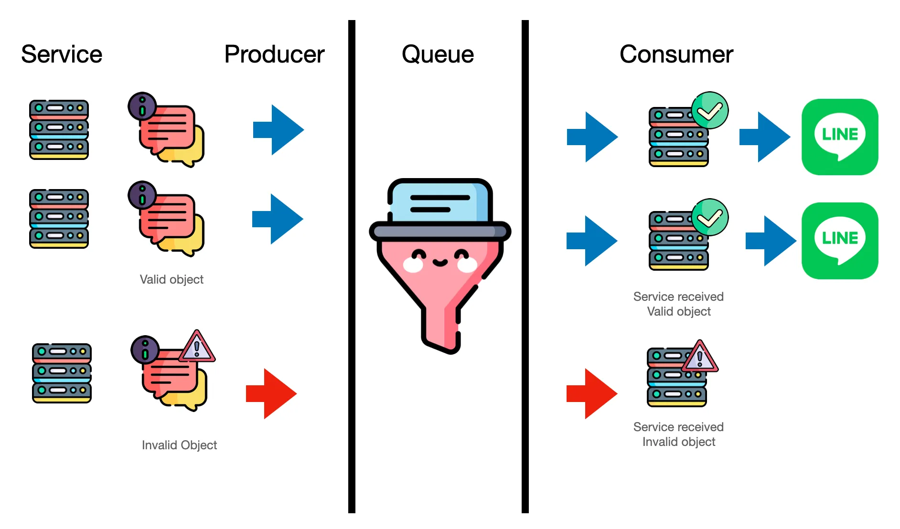

# Validate Message Object API

     

Ref : https://medium.com/linedevth/909c59fc25c9

Validate Message Object API ที่ให้นักพัฒนาสามารถเอาไปใช้ทดสอบความถูกต้องของรูปแบบโครงสร้างกับข้อความรูปแบบต่างๆก่อนที่จะส่งจริงผ่านทั้งการ Reply, Push, Multicast, Narrowcast และ Broadcast ได้แล้ว

Validate message objects of a Reply message
https://developers.line.biz/en/reference/messaging-api/#validate-message-objects-of-reply-message

Validate message objects of a Push message
https://developers.line.biz/en/reference/messaging-api/#validate-message-objects-of-push-message

Validate message objects of a Multicast message
https://developers.line.biz/en/reference/messaging-api/#validate-message-objects-of-multicast-message

Validate message objects of a Narrowcast message
https://developers.line.biz/en/reference/messaging-api/#validate-message-objects-of-narrowcast-message

Validate message objects of a Broadcast message
https://developers.line.biz/en/reference/messaging-api/#validate-message-objects-of-broadcast-message

ถ้าองค์กรหรือบริษัทใหญ่ๆ ที่มีการ Deliver Message จำนวนมาก และมีการนำเทคโนโลยี Queue มาช่วยจัดการ สิ่งที่เกิดขึ้น มันจะเป็น อภิมหา ความอลหม่าน หลายอย่าง ที่แน่ๆ ถ้าใช้ ประเภท Cloud Service ค่าใช้จ่าย น้ำตาร่วงแน่

     

