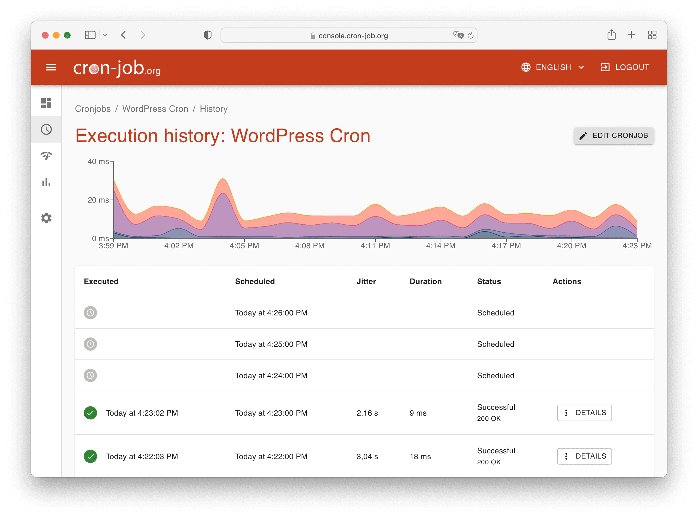

# Workshop Cron-Job 

     

เป็นบริการออนไลน์ที่ให้คุณสร้างและจัดการงาน Cron แบบฟรี ๆ โดยที่ไม่จำเป็นต้องตั้งค่า Cron jobs บนเซิร์ฟเวอร์ของคุณเอง ซึ่ง Cron jobs เป็นวิธีการที่ใช้ในการตั้งเวลาให้สคริปต์หรือโปรแกรมทำงานอัตโนมัติตามกำหนดเวลา เช่น ทุก ๆ ชั่วโมง ทุก ๆ วัน หรือทุก ๆ สัปดาห์

## ขั้นตอนการใช้งาน
1. สมัครสมาชิก
    - ไปที่เว็บไซต์ cron-job.org แล้วคลิกที่ปุ่ม “Sign Up” หรือ “Register” เพื่อสมัครสมาชิก.
    - กรอกข้อมูลที่จำเป็น เช่น อีเมลและรหัสผ่าน จากนั้นยืนยันบัญชีของคุณผ่านอีเมลที่ได้รับ.
2. เข้าสู่ระบบ
    - เมื่อยืนยันบัญชีเสร็จแล้ว ให้ล็อกอินเข้าสู่ระบบด้วยอีเมลและรหัสผ่านที่สมัครไว้.
3. สร้าง Cron Job
    - เมื่อเข้าสู่ระบบแล้ว ให้ไปที่หน้า "Cronjobs" โดยคลิกที่เมนูหรือปุ่ม "Create Cronjob".
    - กรอกรายละเอียดของงาน Cron:
    - URL: ระบุ URL ที่ต้องการให้เรียกใช้ตามเวลาที่ตั้งค่า (เช่น URL ของสคริปต์ PHP ที่ต้องการเรียกใช้งาน).
    - Request Method: เลือกวิธีการส่งคำขอ เช่น GET หรือ POST.
    - Schedule: ตั้งเวลาที่ต้องการให้เรียกใช้ Cron job (เช่น ทุก ๆ ชั่วโมง, ทุก ๆ วัน, หรือกำหนดเวลาเฉพาะ).
    - Time Zone: เลือกโซนเวลาที่คุณต้องการใช้ในการตั้งเวลา.
    - Authentication: ถ้าต้องการส่งค่า Authentication ไปพร้อมกับการเรียกใช้งาน URL ก็สามารถตั้งค่าได้.
4. จัดการและตรวจสอบงาน Cron
    - หลังจากสร้าง Cron job เสร็จแล้ว คุณสามารถจัดการและตรวจสอบการทำงานของ Cron job ได้ที่หน้า "Cronjobs".
    - คุณสามารถดูประวัติการทำงานของ Cron job, แก้ไข, หรือหยุดการทำงานได้ตามต้องการ.
5. ตั้งค่าเพิ่มเติม
    - คุณสามารถตั้งค่าเพิ่มเติม เช่น การแจ้งเตือนเมื่อ Cron job ล้มเหลว หรือการตั้งค่าสำรองข้อมูลการทำงานได้ในส่วนของการตั้งค่าบัญชี.
6. การทดสอบงาน Cron
    - ก่อนที่จะตั้งเวลาให้ทำงานจริง คุณสามารถใช้ฟีเจอร์ "Run Now" เพื่อทดสอบการทำงานของ Cron job ได้ทันที.

--- 
### จงสร้าง function push message โดยใช้ Cronjob
