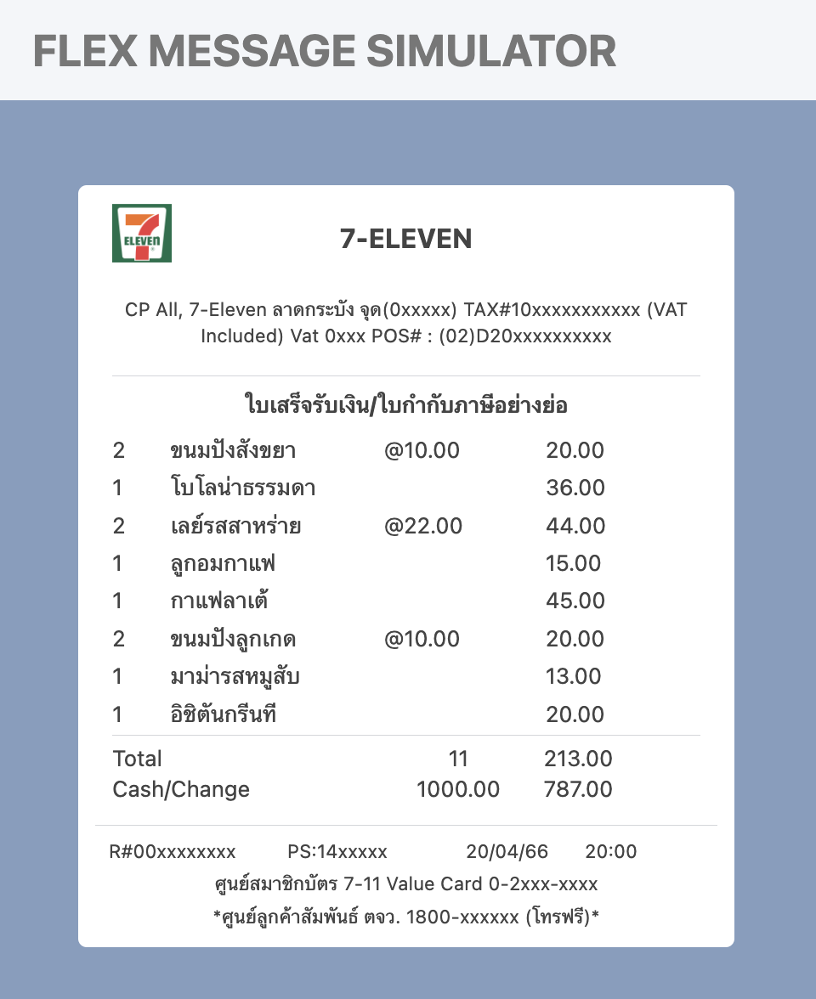

# Workshop : สร้าง LINE Flex Message ใบเสร็จร้าน 7-Eleven


<p align="center" width="100%">
     
</p>

Source 
- image https://seeklogo.com/images/1/7-eleven-logo-D2E5421D84-seeklogo.com.png


### แนวทาง

1. ใช้ ChatGPT เพื่อออกแบบและเขียนโค้ด JSON สำหรับ Flex Message
2. ทดสอบ Flex Message ใน LINE Developer Console หรือใน LINE Bot ของคุณ
3. ตรวจสอบว่าข้อมูลทุกส่วนถูกต้องและสามารถแสดงผลได้อย่างถูกต้อง

### สิ่งที่ต้องส่ง

- โค้ด JSON ของ Flex Message
- ภาพตัวอย่างที่ได้จากการทดสอบใน LINE Developer Console หรือใน LINE Bot

---

# Homework : สร้าง LINE Flex Message แก้ไขปัญหาภาษาไทยให้เห็นครบทุกองค์ประกอบ

<p align="center" width="100%">
     
</p>


เฉลย

### ใบเสร็จเซเว่น

```json
{
  "type": "bubble",
  "size": "mega",
  "header": {
    "type": "box",
    "layout": "baseline",
    "margin": "md",
    "contents": [
      {
        "type": "icon",
        "size": "3xl",
        "url": "https://seeklogo.com/images/1/7-eleven-logo-D2E5421D84-seeklogo.com.png",
        "position": "relative",
        "offsetTop": "md"
      },
      {
        "type": "text",
        "text": "7-ELEVEN",
        "align": "start",
        "gravity": "center",
        "offsetStart": "lg",
        "weight": "bold",
        "size": "md"
      }
    ]
  },
  "body": {
    "type": "box",
    "layout": "vertical",
    "contents": [
      {
        "type": "box",
        "layout": "vertical",
        "contents": [
          {
            "type": "text",
            "text": "CP All, 7-Eleven ลาดกระบัง จุด(0xxxxx) TAX#10xxxxxxxxxxx (VAT Included) Vat 0xxx POS# : (02)D20xxxxxxxxxx",
            "size": "xxs",
            "adjustMode": "shrink-to-fit",
            "wrap": true,
            "align": "center",
            "gravity": "center"
          }
        ],
        "offsetBottom": "xl"
      },
      {
        "type": "separator"
      },
      {
        "type": "text",
        "text": "ใบเสร็จรับเงิน/ใบกำกับภาษีอย่างย่อ",
        "weight": "bold",
        "size": "xs",
        "offsetTop": "md",
        "align": "center",
        "gravity": "center"
      },
      {
        "type": "box",
        "layout": "vertical",
        "margin": "lg",
        "spacing": "sm",
        "contents": [
          {
            "type": "box",
            "layout": "baseline",
            "spacing": "sm",
            "contents": [
              {
                "type": "text",
                "text": "2",
                "flex": 1,
                "size": "xs"
              },
              {
                "type": "text",
                "text": "ขนมปังสังขยา",
                "flex": 4,
                "size": "xs"
              },
              {
                "type": "text",
                "text": "@10.00",
                "size": "xs",
                "flex": 3
              },
              {
                "type": "text",
                "text": "20.00",
                "flex": 3,
                "size": "xs"
              }
            ]
          },
          {
            "type": "box",
            "layout": "baseline",
            "spacing": "sm",
            "contents": [
              {
                "type": "text",
                "text": "1",
                "flex": 1,
                "size": "xs"
              },
              {
                "type": "text",
                "text": "โบโลน่าธรรมดา",
                "flex": 4,
                "size": "xs"
              },
              {
                "type": "text",
                "size": "xs",
                "flex": 3,
                "text": " "
              },
              {
                "type": "text",
                "text": "36.00",
                "flex": 3,
                "size": "xs"
              }
            ]
          },
          {
            "type": "box",
            "layout": "baseline",
            "spacing": "sm",
            "contents": [
              {
                "type": "text",
                "text": "2",
                "flex": 1,
                "size": "xs"
              },
              {
                "type": "text",
                "text": "เลย์รสสาหร่าย",
                "flex": 4,
                "size": "xs"
              },
              {
                "type": "text",
                "text": "@22.00",
                "size": "xs",
                "flex": 3
              },
              {
                "type": "text",
                "text": "44.00",
                "flex": 3,
                "size": "xs"
              }
            ]
          },
          {
            "type": "box",
            "layout": "baseline",
            "spacing": "sm",
            "contents": [
              {
                "type": "text",
                "text": "1",
                "flex": 1,
                "size": "xs"
              },
              {
                "type": "text",
                "text": "ลูกอมกาแฟ",
                "flex": 4,
                "size": "xs"
              },
              {
                "type": "text",
                "text": " ",
                "size": "xs",
                "flex": 3
              },
              {
                "type": "text",
                "text": "15.00",
                "flex": 3,
                "size": "xs"
              }
            ]
          },
          {
            "type": "box",
            "layout": "baseline",
            "spacing": "sm",
            "contents": [
              {
                "type": "text",
                "text": "1",
                "flex": 1,
                "size": "xs"
              },
              {
                "type": "text",
                "text": "กาแฟลาเต้",
                "flex": 4,
                "size": "xs"
              },
              {
                "type": "text",
                "text": " ",
                "size": "xs",
                "flex": 3
              },
              {
                "type": "text",
                "text": "45.00",
                "flex": 3,
                "size": "xs"
              }
            ]
          },
          {
            "type": "box",
            "layout": "baseline",
            "spacing": "sm",
            "contents": [
              {
                "type": "text",
                "text": "2",
                "flex": 1,
                "size": "xs"
              },
              {
                "type": "text",
                "text": "ขนมปังลูกเกด",
                "flex": 4,
                "size": "xs"
              },
              {
                "type": "text",
                "text": "@10.00",
                "size": "xs",
                "flex": 3
              },
              {
                "type": "text",
                "text": "20.00",
                "flex": 3,
                "size": "xs"
              }
            ]
          },
          {
            "type": "box",
            "layout": "baseline",
            "spacing": "sm",
            "contents": [
              {
                "type": "text",
                "text": "1",
                "flex": 1,
                "size": "xs"
              },
              {
                "type": "text",
                "text": "มาม่ารสหมูสับ",
                "flex": 4,
                "size": "xs"
              },
              {
                "type": "text",
                "text": " ",
                "size": "xs",
                "flex": 3
              },
              {
                "type": "text",
                "text": "13.00",
                "flex": 3,
                "size": "xs"
              }
            ]
          },
          {
            "type": "box",
            "layout": "baseline",
            "spacing": "sm",
            "contents": [
              {
                "type": "text",
                "text": "1",
                "flex": 1,
                "size": "xs"
              },
              {
                "type": "text",
                "text": "อิชิตันกรีนที",
                "flex": 4,
                "size": "xs"
              },
              {
                "type": "text",
                "text": " ",
                "size": "xs",
                "flex": 3
              },
              {
                "type": "text",
                "text": "20.00",
                "flex": 3,
                "size": "xs"
              }
            ]
          },
          {
            "type": "separator"
          }
        ],
        "offsetTop": "sm"
      },
      {
        "type": "box",
        "layout": "baseline",
        "contents": [
          {
            "type": "text",
            "text": "Total",
            "size": "xs",
            "flex": 5
          },
          {
            "type": "text",
            "text": "11",
            "size": "xs",
            "flex": 3,
            "align": "center"
          },
          {
            "type": "text",
            "text": "213.00",
            "size": "xs",
            "flex": 3,
            "gravity": "center",
            "align": "start"
          }
        ],
        "offsetTop": "md",
        "justifyContent": "center",
        "alignItems": "center",
        "spacing": "sm"
      },
      {
        "type": "box",
        "layout": "baseline",
        "contents": [
          {
            "type": "text",
            "text": "Cash/Change",
            "size": "xs",
            "flex": 5
          },
          {
            "type": "text",
            "text": "1000.00",
            "size": "xs",
            "flex": 3,
            "align": "center"
          },
          {
            "type": "text",
            "text": "787.00",
            "size": "xs",
            "flex": 3,
            "gravity": "center",
            "align": "start"
          }
        ],
        "offsetTop": "md",
        "justifyContent": "center",
        "alignItems": "center",
        "spacing": "sm"
      }
    ]
  },
  "footer": {
    "type": "box",
    "layout": "vertical",
    "contents": [
      {
        "type": "separator"
      },
      {
        "type": "box",
        "layout": "baseline",
        "contents": [
          {
            "type": "text",
            "text": "R#00xxxxxxxx",
            "size": "xxs",
            "flex": 3
          },
          {
            "type": "text",
            "text": "PS:14xxxxx",
            "size": "xxs",
            "flex": 3
          },
          {
            "type": "text",
            "text": "20/04/66",
            "size": "xxs",
            "flex": 2
          },
          {
            "type": "text",
            "text": "20:00",
            "size": "xxs",
            "flex": 2
          }
        ],
        "paddingAll": "md"
      },
      {
        "type": "box",
        "layout": "vertical",
        "contents": [
          {
            "type": "text",
            "text": "ศูนย์สมาชิกบัตร 7-11 Value Card 0-2xxx-xxxx",
            "size": "xxs",
            "align": "center"
          }
        ],
        "offsetBottom": "sm"
      },
      {
        "type": "box",
        "layout": "vertical",
        "contents": [
          {
            "type": "text",
            "text": "*ศูนย์ลูกค้าสัมพันธ์ ตจว. 1800-xxxxxx (โทรฟรี)*",
            "size": "xxs",
            "align": "center"
          }
        ]
      }
    ]
  }
}

```
